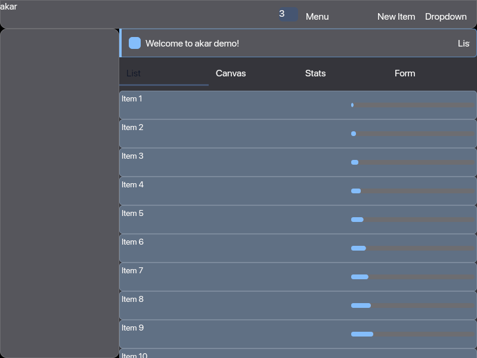
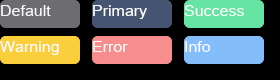
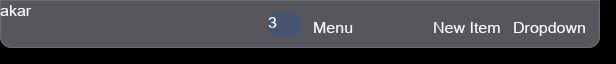
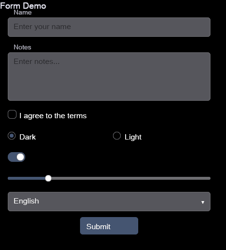
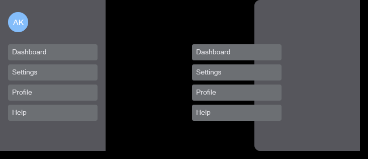
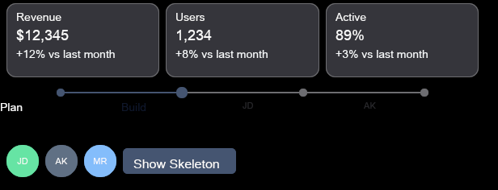
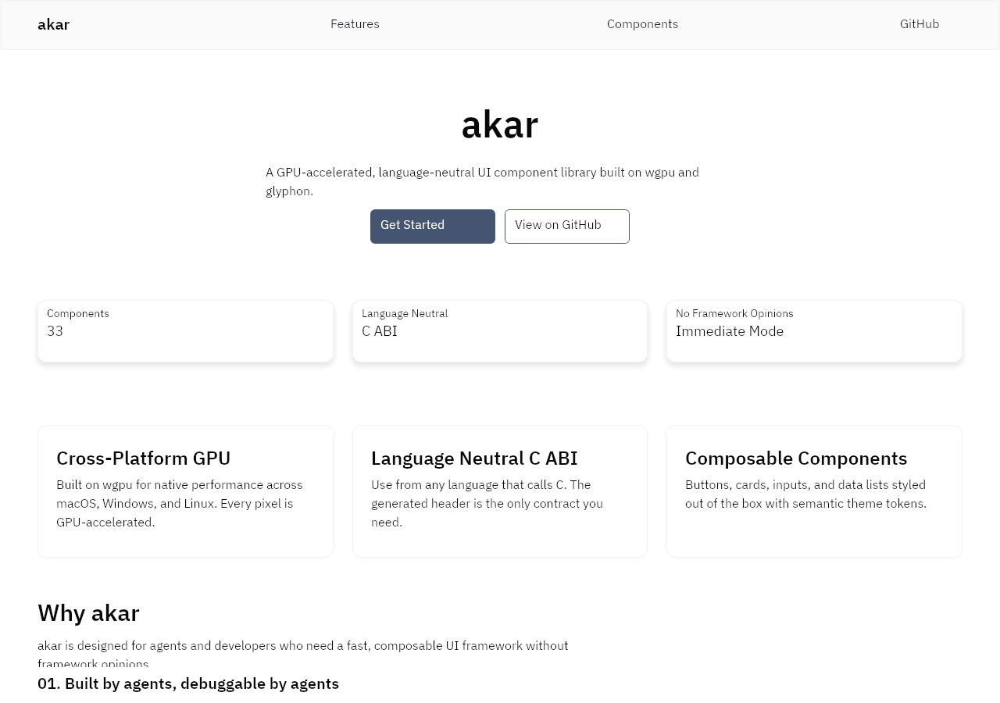

# akar

GPU-accelerated UI components for agents and developers.



## What is akar

akar is an immediate-mode, GPU-rendered UI component library with a C ABI. It ships 30+ ready-to-use components — buttons, cards, inputs, tables, modals, drawers, sliders, toggles, and more — styled out of the box and arranged with a flexbox layout engine. The rendering stack is [wgpu](https://github.com/gfx-rs/wgpu) 29 + [glyphon](https://github.com/grovesNL/glyphon) (cosmic-text backed, GPU atlas), and layout is resolved by [taffy](https://github.com/DioxusLabs/taffy) to pixel coordinates before any draw calls.

The public API is a C ABI (`libakar` + `akar.h`). Rust is the implementation detail; any language that can call C can use akar. No Rust toolchain is required on the consumer side.

The component catalog is inspired by shadcn/ui and daisyUI: a small set of well-styled, composable primitives that cover the vast majority of real desktop UIs without fighting a framework.

## Why akar

Building a desktop or embedded UI with wgpu today means writing your own rect renderer, text shaping pipeline, layout engine, hover/focus state machine, and component primitives from scratch — every time. akar collapses that into a single library with a stable C ABI so you focus on your application, not the rendering plumbing.

**For Rust developers** who want an ImGui-class productivity boost without giving up wgpu's rendering power. **For non-Rust developers** (Go, Python, Zig, Swift, C#, Odin) who want a native GPU UI without a Rust toolchain in their build. **For game and simulation developers** who need UI panels that coexist with a wgpu render pass. **For tool authors** — CLI tools with a GUI escape hatch, data viewers, dev-tool overlays.

## Built by agents, debuggable by agents

akar is primarily built by [opencode](https://opencode.ai) using MiMo v2.5 (multimodal) on the Standard token plan ($16/month). Many of the recent epics — the last 10+ — were tackled almost entirely by the agent, with minimal input from the lead engineer. The approach is straightforward: the agent makes a change, captures a screenshot of the result, analyzes what it sees, and iterates. This feedback loop is working remarkably well.

The `demo-rust` binary ships with a complete visual debug toolchain purpose-built for this workflow. It captures exactly what akar rendered — no OS chrome, no overlapping windows — via wgpu intermediate-texture readback, identically on macOS, Windows, and Linux:

- **Screenshot capture** — `--screenshot /tmp/demo.png --exit` with configurable delay
- **Scripted input injection** — `--script` drives the demo into non-idle states (hover, press, focus, open dropdown) and captures them frame-precisely
- **Component isolation** — `--component <name>` renders a single component and auto-crops the PNG to its bounding box
- **Layout and frame inspection** — `--dump-layout` and `--dump-frame` for element discovery and structured debug output
- **Diff and regression** — `akar-diff` compares two PNGs visually and can gate CI with a changed-pixel threshold

This is a proof of concept that a small team of agents can build a production-quality UI framework. There is much work to be done, but the approach is producing excellent results. See `AGENTS.md` for the full iteration loop and flag reference.

## Component showcase

| | | |
|:---:|:---:|:---:|
|  |  |  |
| Button | Badge | Navbar |
|  |  |  |
| Form | Drawer | Stats |

See the [full component catalog](https://akar.dev/components) for all 33 components, variants, and interactive states.

## The akar marketing page

The full component catalog composes into a real marketing page, rendered entirely by akar's components:



## Quick start

```bash
# Run the demo
cargo run --bin demo-rust

# Capture a screenshot
cargo run --bin demo-rust -- --screenshot /tmp/demo.png --exit

# Isolate a single component
cargo run --bin demo-rust -- --component drawer --screenshot /tmp/drawer.png --exit
```

## Stack

| Layer | Technology |
|---|---|
| Renderer | wgpu 29 (quad + text pipeline) |
| Text | glyphon (cosmic-text backed, GPU atlas) |
| Layout | taffy (CSS Flexbox / Grid) |
| Math | glam |
| C ABI | Rust `extern "C"` + `cbindgen`-generated `akar.h` |
| Windowing (optional) | winit (in `akar-winit` crate) |

## Status

**Pre-alpha.** The API is functional but will change as development continues. See `epics/` for the design roadmap and completion status.

## Documentation

Full documentation and component catalog at [akar.dev](https://akar.dev) (coming soon).

## License

MIT

---

https://github.com/brainless/akar
